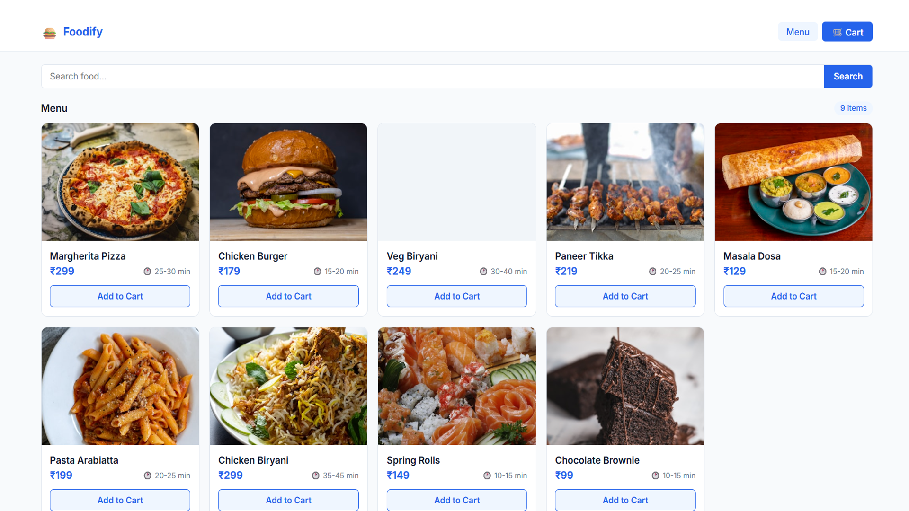
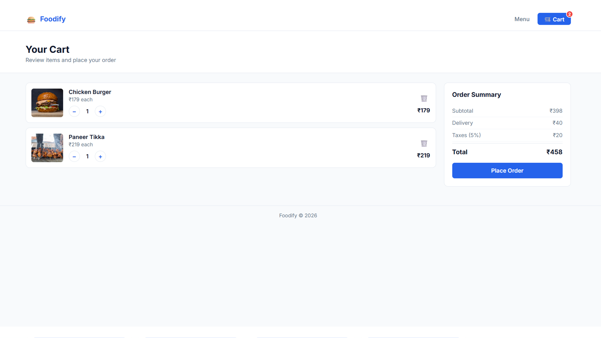
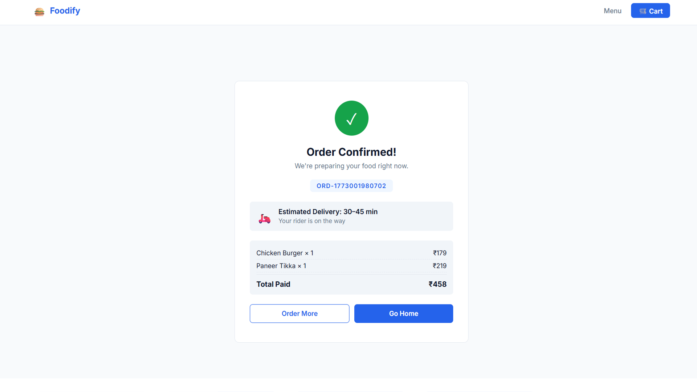

# Project Screenshots

## Homepage


## Cart Page


## Order Confirmation


# Online Food Ordering System (Foodify)

## Overview
Foodify is a full-stack web-based Online Food Ordering System developed using modern web technologies. The application allows users to browse food items, add products to the cart, and place food orders through an interactive and user-friendly interface. The project demonstrates frontend and backend integration using Node.js and Express.js.

## Features
- Browse food menu
- Add items to cart
- Place food orders
- Order confirmation system
- Responsive user interface

## Technologies Used
- HTML
- CSS
- JavaScript
- Node.js
- Express.js
- JSON

## Project Structure

```text
Online-Food-Ordering-System-Foodify/
│
├── public/
├── routes/
├── models/
├── node_modules/
├── package.json
├── package-lock.json
├── server.js
├── foodify-homepage.png
├── foodify-cart.png
├── foodify-order-confirmation.png
└── README.md
```

## Installation

### 1. Clone the repository

```bash
git clone https://github.com/YOUR-USERNAME/Online-Food-Ordering-System-Foodify.git
```

### 2. Navigate to the project folder

```bash
cd Online-Food-Ordering-System-Foodify
```

### 3. Install dependencies

```bash
npm install
```

## How to Run

### 1. Start the server

```bash
npm start
```

### 2. Open browser and visit

```text
http://localhost:5000
```

## Dependencies
- Express.js
- Node.js
- JSON
- npm

## Future Improvements
- Online payment integration
- User authentication system
- Admin dashboard
- Real-time order tracking
- Database integration using MongoDB

## Conclusion
The Online Food Ordering System (Foodify) demonstrates the implementation of a full-stack web application that simplifies digital food ordering. The project provides an interactive and user-friendly platform for browsing food items, managing cart functionality, and placing orders efficiently.
